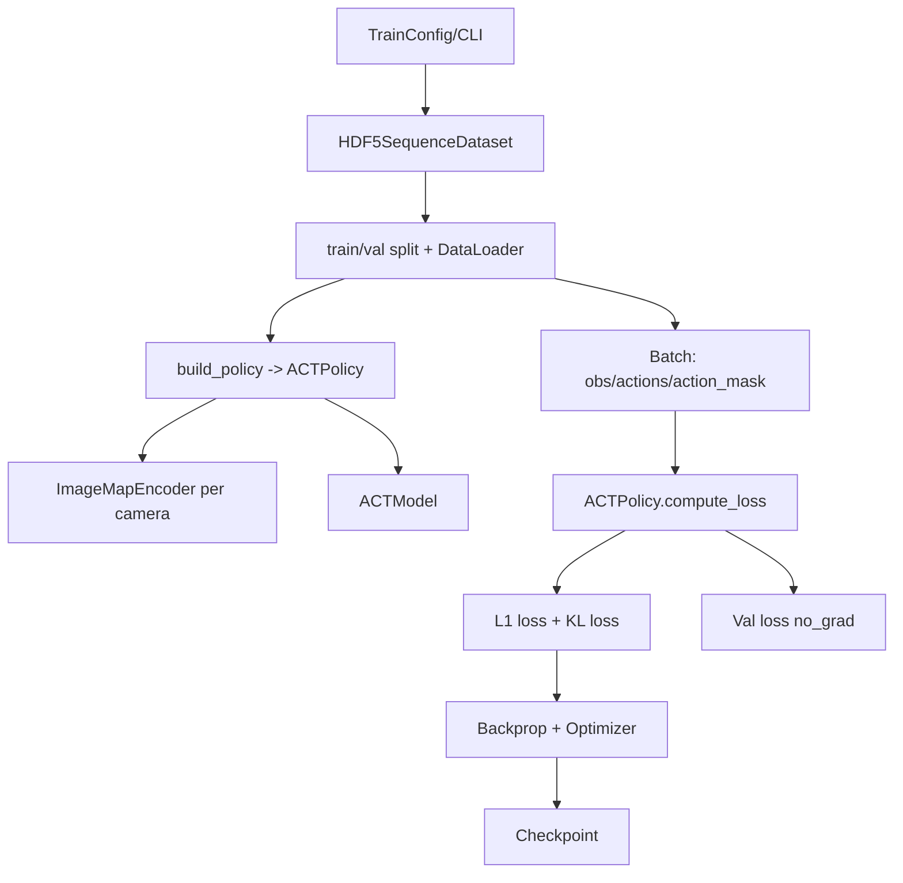
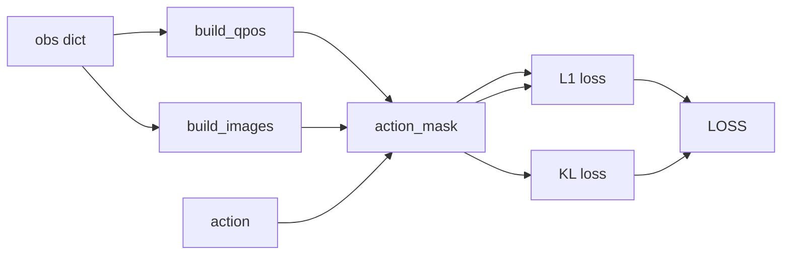

# ACT Training/Validation Guide

This doc summarizes the ACT training/validation pipeline, data flow, key parameters, and a CLI example.

## 1. Pipeline Flow



## 2. Data Flow (Training)



## 3. Key Parameters

### 3.1 Data
- `data.obs_horizon`: observation window length (ACT uses the last step)
- `data.predict_horizon`: action chunk length
- `data.image_norm`: typical setting is `imagenet`

### 3.2 ACT Model
- `policy.act.model.backbone`
- `policy.act.model.hidden_dim`
- `policy.act.model.enc_layers` / `policy.act.model.dec_layers`
- `policy.act.model.nheads`
- `policy.act.model.dim_feedforward`
- `policy.act.model.pretrained`
- `policy.act.model.dilation`

### 3.3 ACT Training
- `policy.act.kl_weight`
- `policy.act.lr_backbone`
- `policy.act.temporal_ensemble_coeff` (optional; enables temporal ensembling in inference)

### 3.4 LR Scheduler (optional)
- `policy.act.scheduler.name` (`none` | `cosine` | `linear` | `constant`)
- `policy.act.scheduler.warmup_steps`
- `policy.act.scheduler.num_training_steps` (optional override)
- `policy.act.scheduler.min_lr` (optional)

## 4. CLI Example (ACT)

```bash
python standalone/train.py \
  --data.demo_file=./libero/datasets/libero_object_single/pick_up_the_alphabet_soup_and_place_it_in_the_basket_demo.hdf5 \
  --policy.name=act \
  --data.obs_horizon=1 \
  --data.predict_horizon=100 \
  --data.image_norm=imagenet \
  --policy.act.model.hidden_dim=512 \
  --policy.act.model.dim_feedforward=3200 \
  --policy.act.kl_weight=10.0 \
  --paths.save_dir=standalone/standalone_runs/train_act_quickcheck
```

## 5. Notes

- ACT uses `ImageMapEncoder` (feature maps, not pooled vectors).
- If `obs_horizon > 1`, only the last step is used.
- `action_mask` is converted to `is_pad` and used to mask L1 loss.
