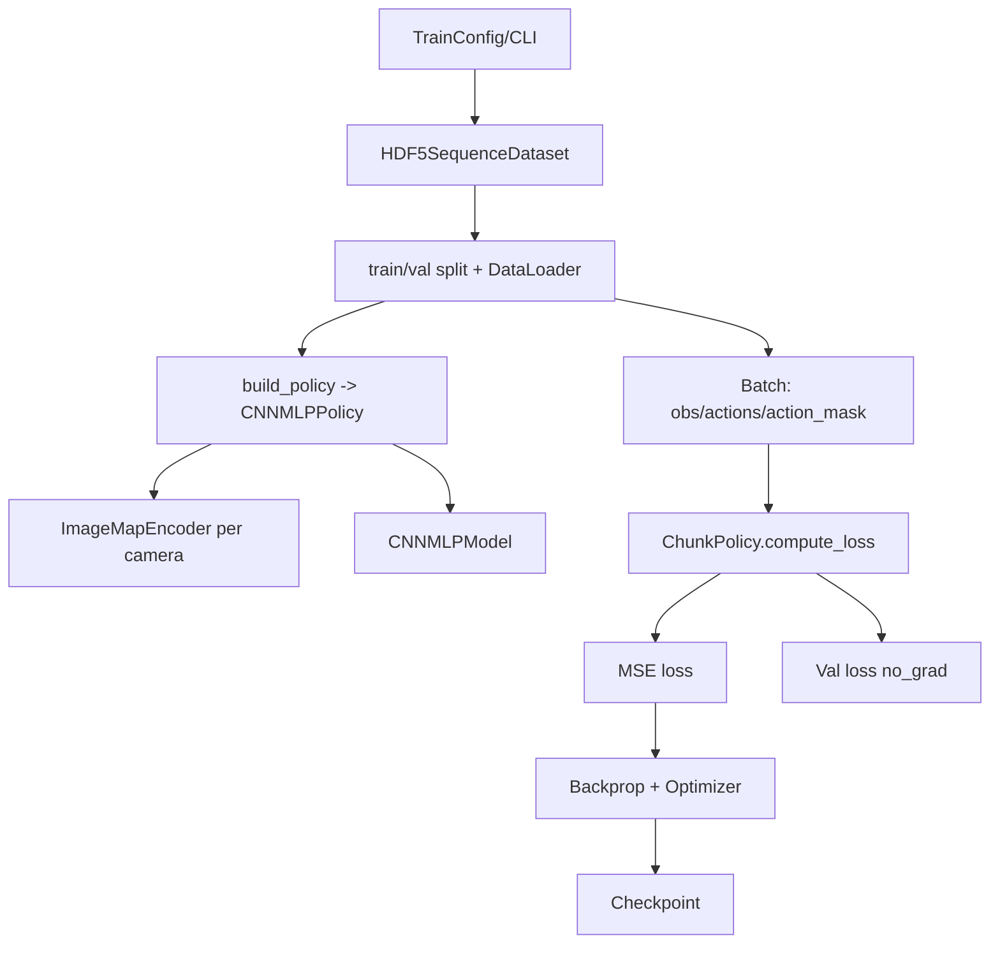
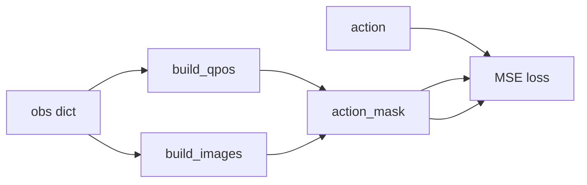

# CNNMLP Training/Validation Guide

This doc summarizes the CNNMLP training/validation pipeline, data flow, key parameters, and a CLI example.

## 1. Pipeline Flow



## 2. Data Flow (Training)



## 3. Key Parameters

### 3.1 Data
- `data.obs_horizon`: observation window length (CNNMLP uses the last step)
- `data.predict_horizon`: action chunk length
- `data.image_norm`: typical setting is `imagenet`

### 3.2 CNNMLP Model
- `policy.cnnmlp.model.backbone`
- `policy.cnnmlp.model.hidden_dim`
- `policy.cnnmlp.model.pretrained`
- `policy.cnnmlp.model.dilation`

### 3.3 CNNMLP Training
- `policy.cnnmlp.lr_backbone`

### 3.4 LR Scheduler (optional)
- `policy.cnnmlp.scheduler.name` (`none` | `cosine` | `linear` | `constant`)
- `policy.cnnmlp.scheduler.warmup_steps`
- `policy.cnnmlp.scheduler.num_training_steps` (optional override)
- `policy.cnnmlp.scheduler.min_lr` (optional)

## 4. CLI Example (CNNMLP)

```bash
python standalone/train.py \
  --data.demo_file=./libero/datasets/libero_object_single/pick_up_the_alphabet_soup_and_place_it_in_the_basket_demo.hdf5 \
  --policy.name=cnnmlp \
  --data.obs_horizon=1 \
  --data.predict_horizon=100 \
  --data.image_norm=imagenet \
  --policy.cnnmlp.model.hidden_dim=256 \
  --paths.save_dir=standalone/standalone_runs/train_cnnmlp_quickcheck
```

## 5. Notes

- CNNMLP uses `ImageMapEncoder` (feature maps, not pooled vectors).
- If `obs_horizon > 1`, only the last step is used.
- Loss uses `action_mask` via `ChunkPolicy.compute_loss`.
