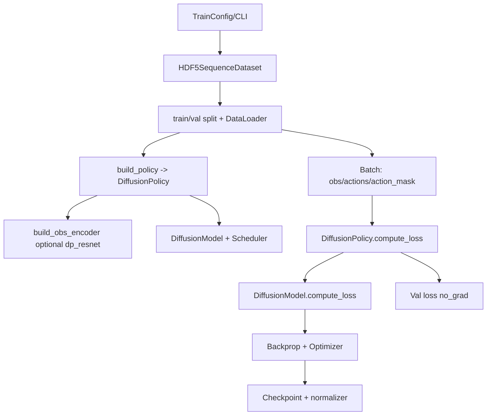
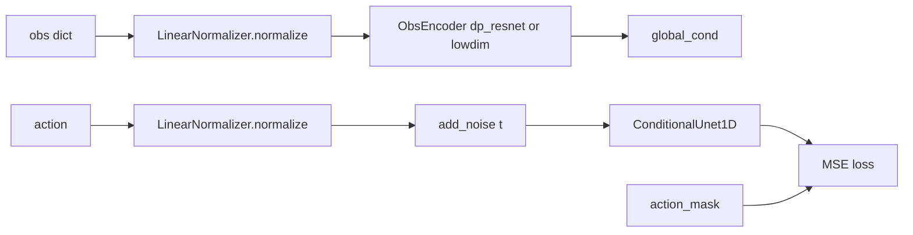

# Diffusion Policy (DP) Training/Validation Guide

This doc summarizes the DP training/validation pipeline, data flow, key parameters, and a CLI example.

## 1. Pipeline Flow



## 2. Data Flow (Training)



## 3. Key Parameters

### 3.1 Data
- `data.obs_horizon`: observation window length
- `data.predict_horizon`: action chunk length
- `data.image_norm`: recommend `scale_0_1` for DP encoder inputs

### 3.2 DP Encoder (dp_resnet)
- `policy.dp.encoder.image.type=dp_resnet`
- `policy.dp.encoder.image.pretrained=false`
- `policy.dp.encoder.image.use_group_norm=true`
- `policy.dp.encoder.image.spatial_softmax_num_keypoints=32`
- `policy.dp.encoder.image.use_separate_rgb_encoder_per_camera=false` (set true for per-camera encoders)
- `policy.dp.encoder.image.output_dim` (optional; set to `64` to match 32 keypoints * 2)
- `policy.dp.encoder.image.crop_randomizer.enable=true/false`
  - training uses random crop; eval uses center crop

### 3.3 DP Model
- `policy.dp.model.horizon`
- `policy.dp.model.n_obs_steps`
- `policy.dp.model.n_action_steps`
- `policy.dp.model.down_dims` (default 512/1024/2048)
- `policy.dp.model.diffusion_step_embed_dim` (default 128)
- `policy.dp.model.kernel_size`
- `policy.dp.model.n_groups`
- `policy.dp.model.do_mask_loss_for_padding=true/false`

### 3.4 Noise Scheduler
- `policy.dp.model.noise_scheduler_type=DDPM|DDIM`
- `policy.dp.model.num_train_timesteps`
- `policy.dp.model.beta_schedule`
- `policy.dp.model.beta_start`
- `policy.dp.model.beta_end`
- `policy.dp.model.prediction_type=epsilon|sample`
- `policy.dp.model.clip_sample`
- `policy.dp.model.clip_sample_range`
- `policy.dp.model.num_inference_steps` (optional)

### 3.5 Normalizer (DP only)
- `policy.dp.normalizer.enable`
- `policy.dp.normalizer.normalize_obs`
- `policy.dp.normalizer.normalize_actions`
- `policy.dp.normalizer.mode` (limits/gaussian)

## 4. CLI Example (DP)

```bash
python standalone/train.py \
  --data.demo_file=./libero/datasets/libero_object_single/pick_up_the_alphabet_soup_and_place_it_in_the_basket_demo.hdf5 \
  --policy.name=dp \
  --data.obs_horizon=2 \
  --data.predict_horizon=8 \
  --data.image_norm=scale_0_1 \
  --policy.dp.encoder.image.type=dp_resnet \
  --policy.dp.encoder.image.pretrained=false \
  --policy.dp.encoder.image.use_group_norm=true \
  --policy.dp.encoder.image.spatial_softmax_num_keypoints=32 \
  --policy.dp.model.horizon=16 \
  --policy.dp.model.n_obs_steps=2 \
  --policy.dp.model.n_action_steps=8 \
  --policy.dp.model.noise_scheduler_type=DDPM \
  --policy.dp.model.do_mask_loss_for_padding=true \
  --paths.save_dir=standalone/standalone_runs/train_dp_quickcheck
```

## 5. Notes

- **Horizon constraint**: `horizon % (2 ** len(down_dims)) == 0`.
- **Multi-camera consistency**: all `image_keys` shapes must match.
- **Crop alignment**: training random crop, eval center crop; defaults are `num_crops=1`, `pos_enc=false`.
- **action_mask**: used when `do_mask_loss_for_padding=true`.
- **Length relationship**: `horizon (generated length) >= n_action_steps (output chunk length) >= exec_horizon (executed length)`.

## 6. Terminology and Lengths (Clarification)

Your intended interpretation is correct, and the DP logic is consistent with it:

- **exec_horizon**: how many actions are actually executed each step (what you *do*).
- **predict_horizon / n_action_steps**: how many actions the model outputs and the dataset supervises (what you *predict*).
- **horizon**: the full action trajectory length the diffusion model generates internally (what DP *samples*).

The default mapping in this codebase is:

```
policy.dp.model.n_obs_steps = data.obs_horizon
policy.dp.model.n_action_steps = data.predict_horizon
policy.dp.model.horizon = data.obs_horizon + data.predict_horizon - 1
```

This ensures the DP constraint holds:

```
n_action_steps <= horizon - n_obs_steps + 1
```

In words: the model generates a longer trajectory internally (`horizon`), then takes a chunk (`n_action_steps`) to output, and only the first `exec_horizon` steps are executed.
